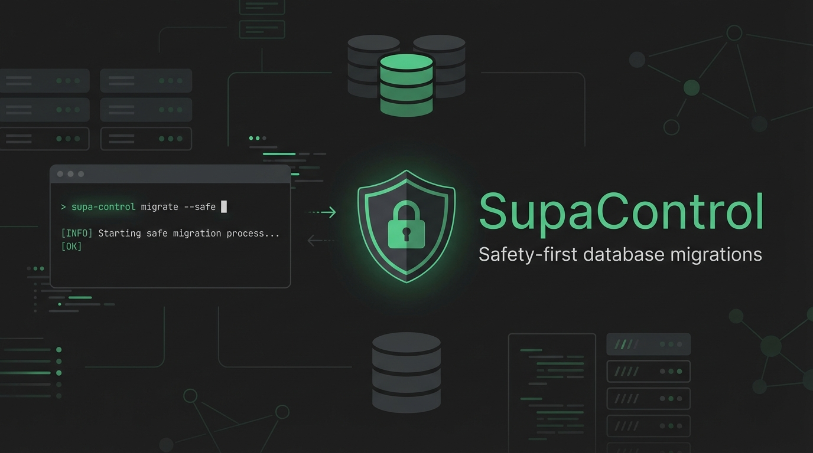

<p align="center">
  
</p>

<h1 align="center">SupaControl</h1>

<p align="center">
  <strong>Safety-first CLI wrapper for Supabase with environment guards and confirmation prompts</strong>
</p>

<p align="center">
  <a href="https://github.com/supacontrol/supacontrol/actions/workflows/ci.yml"></a>
  <a href="https://www.npmjs.com/package/@supacontrol/cli"></a>
  <a href="https://www.npmjs.com/package/@supacontrol/cli"></a>
  <a href="https://github.com/supacontrol/supacontrol/blob/main/LICENSE"></a>
  <a href="https://nodejs.org"></a>
</p>

<p align="center">
  <a href="#why-supacontrol">Why?</a> &bull;
  <a href="#installation">Installation</a> &bull;
  <a href="#quick-start">Quick Start</a> &bull;
  <a href="#configuration">Configuration</a> &bull;
  <a href="#commands">Commands</a> &bull;
  <a href="#safety-features">Safety Features</a> &bull;
  <a href="#cicd-usage">CI/CD</a>
</p>

---

## Why SupaControl?

The Supabase CLI is powerful but dangerous. **One wrong command on the wrong branch can wipe your production database.**

SupaControl wraps the Supabase CLI with safety guards that prevent accidents:

| Problem | SupaControl Solution |
|---------|---------------------|
| Accidentally ran `db reset` on production | **Environment locking** - Production locked by default |
| Pushed migrations to wrong project | **Project ref validation** - Verifies you're targeting the right database |
| Ran destructive command on wrong branch | **Branch-based detection** - Auto-detects environment from git branch |
| Fat-fingered a dangerous command | **Confirmation prompts** - Type environment name to confirm |
| Uncommitted changes before migration | **Git status checks** - Requires clean working directory |

```bash
# Without SupaControl
$ supabase db reset  # Hope you're not on production...

# With SupaControl  
$ supacontrol reset
✗ Environment 'production' is locked
  Suggestions:
  • Set 'locked = false' in supacontrol.toml for [environments.production]
  • Or use --force flag to override (not recommended for production)
```

## Prerequisites

Before using SupaControl, you need:

1. **Node.js 18+** - [Download](https://nodejs.org/)
2. **Supabase CLI** - [Installation Guide](https://supabase.com/docs/guides/cli/getting-started)
   ```bash
   # npm
   npm install -g supabase
   
   # Homebrew (macOS/Linux)
   brew install supabase/tap/supabase
   
   # Scoop (Windows)
   scoop bucket add supabase https://github.com/supabase/scoop-bucket.git
   scoop install supabase
   ```
3. **A Supabase project** initialized with `supabase init`

## Installation

```bash
# npm
npm install -g @supacontrol/cli

# pnpm (recommended)
pnpm add -g @supacontrol/cli

# yarn
yarn global add @supacontrol/cli
```

Verify installation:

```bash
supacontrol --version
# or use short aliases
supac --version
spc --version
```

## Quick Start

```bash
# 1. Navigate to your Supabase project
cd your-project

# 2. Initialize SupaControl (interactive setup)
supacontrol init

# 3. Check your setup
supacontrol doctor

# 4. View current status
supacontrol status

# 5. Push migrations safely
supacontrol push
```

The `init` command will guide you through:
- Selecting your environments (local, staging, production)
- Linking Supabase projects to each environment
- Configuring safety settings

## Configuration

SupaControl uses a `supacontrol.toml` file in your project root:

```toml
[settings]
# Fail on any guard warning, not just errors
strict_mode = false

# Require clean git working tree before destructive operations
require_clean_git = true

# Show migration diff before push
show_migration_diff = true

[environments.staging]
# Supabase project reference (from dashboard URL or `supabase projects list`)
project_ref = "abcdefghijklmnop"

# Git branches that map to this environment
git_branches = ["develop", "staging"]

# Operations that require typing confirmation word
protected_operations = ["reset"]

[environments.production]
project_ref = "qrstuvwxyz123456"
git_branches = ["main", "master"]
protected_operations = ["push", "reset", "seed"]

# Custom word to type for confirmation (default: environment name)
confirm_word = "production"

# Lock environment - blocks ALL destructive operations (default: true for production)
locked = true
```

### Configuration Reference

#### Global Settings

| Option | Type | Default | Description |
|--------|------|---------|-------------|
| `strict_mode` | boolean | `false` | Treat warnings as errors |
| `require_clean_git` | boolean | `true` | Block operations with uncommitted changes |
| `show_migration_diff` | boolean | `true` | Show diff before pushing migrations |

#### Environment Options

| Option | Type | Default | Description |
|--------|------|---------|-------------|
| `project_ref` | string | *required* | Supabase project reference ID |
| `git_branches` | string[] | `[]` | Git branches that map to this environment |
| `protected_operations` | string[] | `[]` | Operations requiring confirmation |
| `confirm_word` | string | env name | Word to type for confirmation |
| `locked` | boolean | `true` for production | Block all destructive operations |

#### Branch Pattern Matching

Use wildcards to match multiple branches:

```toml
[environments.preview]
project_ref = "preview-project-ref"
git_branches = ["feature/*", "pr-*", "preview/*"]
```

## Commands

### `supacontrol init`

Interactive setup wizard to create `supacontrol.toml`.

```bash
supacontrol init
```

Features:
- Detects existing Supabase projects in your account
- Supports Supabase Branching (production + branch = staging)
- Creates sensible defaults for each environment

### `supacontrol status`

Show current environment, linked project, and configuration.

```bash
supacontrol status
```

Output:
```
SupaControl Status
──────────────────────────────────────────────────

Active Environment: staging 🔓
  Project: my-app (staging branch)
  Status: unlocked
  Protected: reset

Git: develop

Environments
  → staging 🔓 ← active
    production 🔒

Supabase CLI v2.67.1
```

### `supacontrol push`

Push local migrations to remote database.

```bash
# Auto-detect environment from current git branch
supacontrol push

# Target specific environment
supacontrol push --env staging
supacontrol push -e staging

# Preview what would be pushed (no changes made)
supacontrol push --dry-run

# Bypass safety guards (use with extreme caution!)
supacontrol push --force
```

### `supacontrol pull`

Pull schema changes from remote database to local migrations.

```bash
supacontrol pull
supacontrol pull --env staging
```

### `supacontrol reset`

Reset remote database to match local migrations. **This is destructive!**

```bash
supacontrol reset
supacontrol reset --env staging
```

### `supacontrol switch`

Switch to a different environment (relinks Supabase project).

```bash
supacontrol switch staging
supacontrol switch production
```

This runs `supabase link` under the hood and updates your local project reference.

### `supacontrol lock / unlock`

Lock or unlock an environment to control access.

```bash
# Lock production (blocks all destructive operations)
supacontrol lock production

# Unlock staging for maintenance
supacontrol unlock staging
```

### `supacontrol doctor`

Health check for your SupaControl setup.

```bash
supacontrol doctor
```

Checks:
- Supabase CLI installed and version
- Git repository status
- SupaControl config validity
- Project linking status
- Environment safety settings

## Safety Features

### Lock Guard

Production environments are **locked by default**. Locked environments block ALL destructive operations:

```
✗ Environment 'production' is locked

Suggestions:
  • Set 'locked = false' in supacontrol.toml for [environments.production]
  • Or use --force flag to override (not recommended for production)
```

### Operation Guard

Protected operations require typing a confirmation word:

```
⚠ This will reset the staging database
  Type 'staging' to confirm: █
```

### Project Guard

Validates that the linked Supabase project matches the expected environment:

```
✗ Project mismatch
  Linked: wrong-project-ref
  Expected: correct-project-ref (production)
  
Suggestions:
  • Run 'supacontrol switch production' to link the correct project
```

### Git Guard

Requires clean git working directory for destructive operations:

```
✗ Uncommitted changes detected

Suggestions:
  • Commit or stash your changes before running this command
  • Or set 'require_clean_git = false' in supacontrol.toml (not recommended)
```

## CI/CD Usage

### GitHub Actions Example

```yaml
name: Deploy Migrations

on:
  push:
    branches: [main]
    paths:
      - 'supabase/migrations/**'

jobs:
  deploy:
    runs-on: ubuntu-latest
    steps:
      - uses: actions/checkout@v4
      
      - name: Setup Node.js
        uses: actions/setup-node@v4
        with:
          node-version: 20
          
      - name: Install Supabase CLI
        uses: supabase/setup-cli@v1
        with:
          version: latest
        
      - name: Install SupaControl
        run: npm install -g @supacontrol/cli
        
      - name: Push migrations to production
        run: supacontrol push --env production --ci
        env:
          SUPABASE_ACCESS_TOKEN: ${{ secrets.SUPABASE_ACCESS_TOKEN }}
```

### CI Mode Flags

| Flag | Description |
|------|-------------|
| `--ci` | Non-interactive mode (no prompts) |
| `-e, --env <name>` | Explicit environment target |
| `--force` | Bypass safety guards (use carefully) |

### Environment Variables

| Variable | Description |
|----------|-------------|
| `SUPABASE_ACCESS_TOKEN` | Supabase access token for API operations |
| `CI` | When set, enables CI mode automatically |

## CLI Aliases

The CLI is available under three names for convenience:

| Alias | Usage |
|-------|-------|
| `supacontrol` | Full name |
| `supac` | Short name |
| `spc` | Very short name |

All three are identical and can be used interchangeably.

## Contributing

We welcome contributions! See [CONTRIBUTING.md](./CONTRIBUTING.md) for guidelines.

```bash
# Clone the repo
git clone https://github.com/supacontrol/supacontrol.git
cd supacontrol

# Install dependencies
pnpm install

# Run tests
pnpm test

# Build
pnpm build
```

## License

MIT - see [LICENSE](./LICENSE) for details.

---

<p align="center">
  <sub>Built with care to prevent database disasters</sub>
</p>
